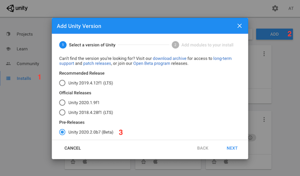
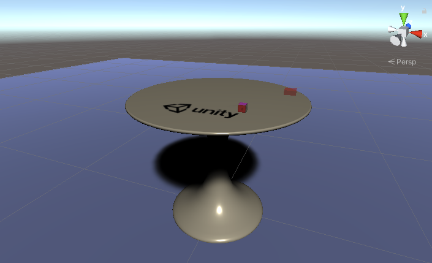
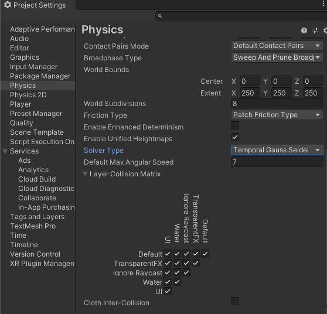
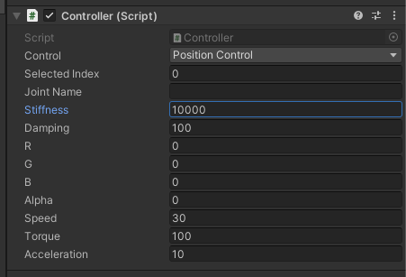
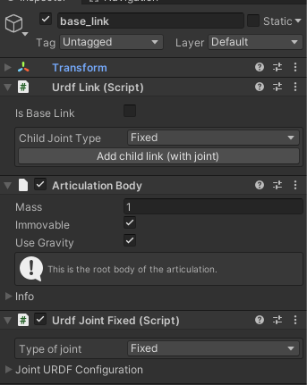
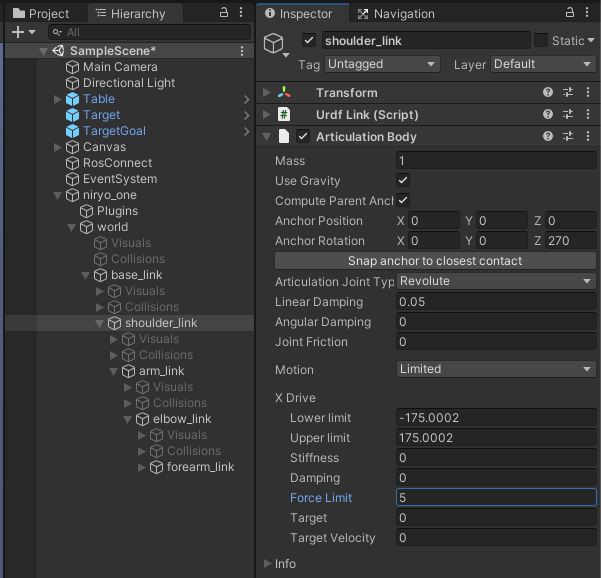
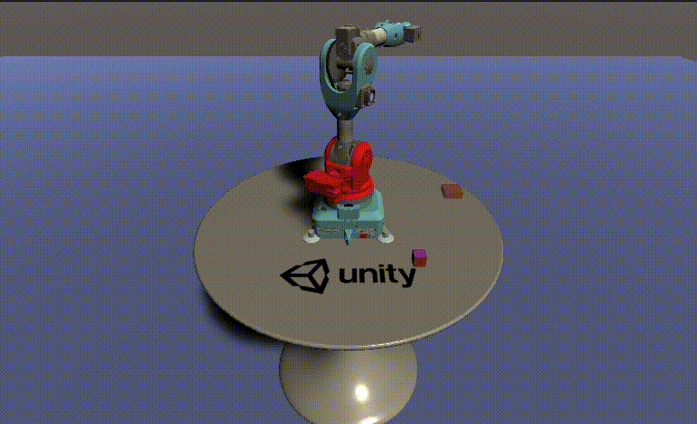

# Pick and Place Tutorial

This part includes downloading and installing the Unity Editor, setting up a basic Unity scene, and importing a robot using the URDF importer.

If you are not familiar with Unity, check out the [Roll-a-Ball tutorial](https://learn.unity.com/project/roll-a-ball) to get started.

## Table of Contents
- [Pick and Place Tutorial](#pick-and-place-tutorial)
  - [Table of Contents](#table-of-contents)
  - [Part 1: Create Unity scene with imported URDF](#part-1-create-unity-scene-with-imported-urdf)
  - [Troubleshooting](#troubleshooting)
  - [Resources](#resources)

---

## Part 1: Create Unity scene with imported URDF
  
- Install [Unity Hub](https://unity3d.com/get-unity/download).
  
- Open Unity Hub and navigate to the Installs tab. Select `ADD` to install the latest version of Unity 2020.2 (2020.2.0b9 as of the latest revision).
   
 

- In the Unity Hub, go to the Projects tab. Click the dropdown arrow next to `NEW`, and select the newly downloaded 2020.2 version. Create a new project using the 3D Template.

- Clone or download this repository to your local machine. Navigate to the `Unity-Robotics-Hub/tutorials/pick_and_place/` directory. Find the `PickAndPlace.unitypackage` file, and double click it.
  > Note: this .unitypackage can also be found in the latest [Pick and Place Release](https://github.com/Unity-Technologies/Unity-Robotics-Hub/releases) as "PickAndPlace.zip".

- In the Import Unity Package window that has opened, ensure everything is selected, and click `Import`. Once this is done, new folders in the Assets directory will appear, including Environment, Materials, Prefabs, and URDF.
  
- Double click to load the `Assets/Scenes/SampleScene` if it is not already open. In the Unity Project window, navigate to `Assets/Prefabs`. Select the Table prefab, and click and drag it into the Hierarchy window. The table should appear in the Scene view. Then, select and drag the Target into the Hierarchy window, as well as the TargetPlacement. They should appear to sit on the table.

 

- Move the camera to a more convenient location for viewing the robot, e.g. assign the `Main Camera`'s Position to `(0, 1.4, -0.7)`, and the Rotation to `(45, 0, 0)` in the Inspector.

- Open the Physics Project Settings (Edit > Project Settings > Physics). Set the `Solver Type` to `Temporal Gauss Seidel`. This prevents erratic behavior in the joints that may be caused by the default solver.



- Create a new folder in your Unity project's Assets directory titled `Plugins`.

- Clone or download the [URDF Importer Repo](https://github.cds.internal.unity3d.com/unity/URDF-Importer). Copy the `UnityEditorScripts` and `URDFLibrary` directories into the `Assets/Plugins` directory of your Unity project. 

- Find and select the URDF file in the Project window (`Assets/URDF/niryo_one/niryo_one.urdf`). From the menu, click `Assets -> Import Robot from URDF`, or in the Project window, right click on the selected file and click `Import Robot from URDF`.
  > Note: The file extension may not appear in the Project window. The niryo_one.urdf file will appear in the root of the `Assets/URDF/niryo_one` directory.

  > Note: If the menu option does not appear, check the Console window to check for any compilation errors. 
  
- Keep the default Y Axis type in the Import menu and click `Import URDF`.
  
  > Note: Default mesh orientation is Y-up, which is supported by Unity, but some packages often use Z-up and X-up configuration.

  > Note: The world-space origin of the robot is defined in its URDF file. In this sample, we have assigned it to sit on top of the table, which is at `(0, 0.63, 0)` in Unity coordinates.
  
  ```xml
  <joint name="joint_world" type="fixed">
    <parent link="world" />
    <child link="base_link" />
    <origin xyz="0 0 0.63" rpy="0 0 0" />
  </joint>
  ```

- On the Controller script of the top-level `niryo_one` object, set the Stiffness to `10000` and the Damping to `100`. Set the Speed to `30` and the Acceleration to `10`.
	> Note: You can find more information on what these values do by referencing [this](https://github.com/Unity-Technologies/Unity-Robotics-Hub/blob/master/tutorials/urdf_importer/urdf_appendix.md#guide-to-write-your-own-controller) guide but for our purposes these settings will allow the robot to stay in position without the joints slipping.

 
  
- In the Hierarchy window, click the arrow to the left of the name to expand the GameObject tree, down to `niryo_one/world/base_link`. Toggle on `Immovable` for the `base_link`.

 

> Note: A controller is pre-built in the Unity URDF importer to help showcase the movement of the Niryo. The Controller script is added to the imported URDF by default. This will add FKrobot and Joint Control components at runtime. The Controller script can be found in the project at `Assets/Plugins/UnityEditorScripts/Urdf/Controller/Controller.cs`.

- On the shoulder_link (i.e. `niryo_one/world/base_link/shoulder_link`), set the X Drive Force Limit to `5` which will increase the speed at which the shoulder joint can rotate.



- Press Play. If everything imported correctly, no errors should appear in the Console window. The robot arm should stay “mounted” to the table, and nothing should fall through the floor. 
  
> Note: Using the Controller, joints can be selected using the arrow keys. Use the left/right arrow keys to navigate through the joints, where the selected index will be highlighted in red. Use the up/down arrow keys to control the selected joint movement. The Controller script on the niryo_one object will describe the actively Selected Index as well as the Joint Name.

 

- Learn more about the URDF importer tool [here](https://github.com/Unity-Technologies/Robotics-Tutorials/blob/master/urdf_tutorial.md).

---

## Troubleshooting

- If the robot appears loose/wiggly or is not moving with no console errors, ensure that the Stiffness and Damping values on the Controller script of the `niryo_one` object are set to `10000` and `100`, respectively.

---

## Resources

- [Roll-a-Ball tutorial](https://learn.unity.com/project/roll-a-ball)
- More on the URDF importer tool [here](https://github.com/Unity-Technologies/Robotics-Tutorials/blob/master/urdf_tutorial.md)
- Unity [Articulation Body Documentation](https://docs.unity3d.com/2020.1/Documentation/ScriptReference/ArticulationBody.html)
<!-- - All of the launch and config files used were copied from [Niryo One ROS Stack](https://github.com/NiryoRobotics/niryo_one_ros) and edited to suit our reduced use case -->

---


Proceed to [Part 2](2_ros_tcp.md).