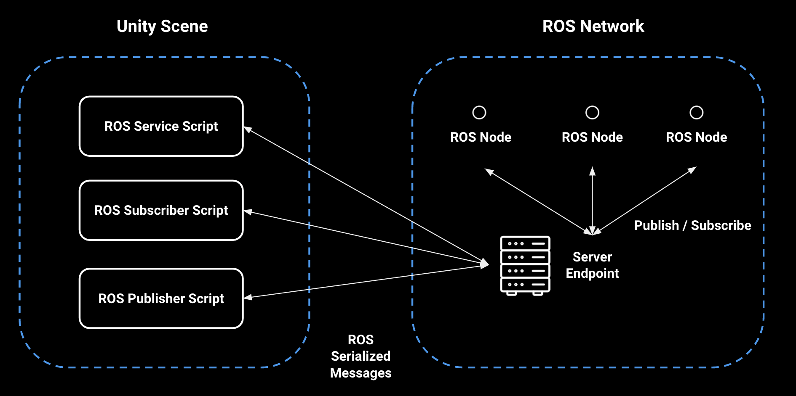
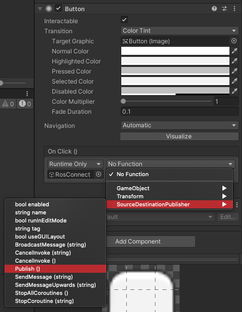
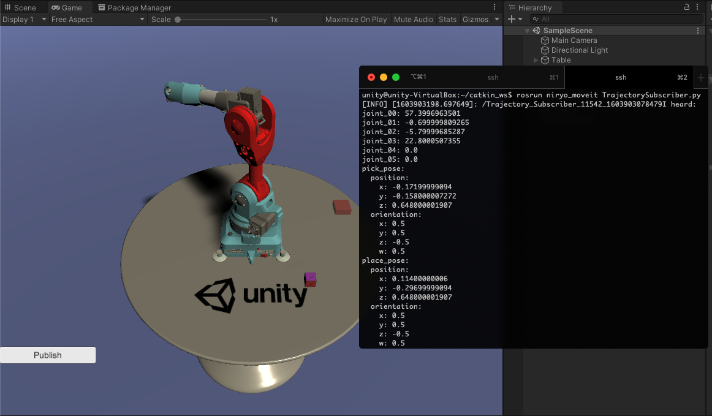

# Pick and Place Tutorial [DRAFT]

This step assumes you have access to a functional ROS workspace. If you do not yet have a working ROS setup, refer to the [Resources](#resources) section below to get started.

Steps covered in this tutorial include creating a TCP connection between Unity and ROS, generating C# scripts from a ROS msg, and publishing and subscribing to a ROS Topic.

## Table of Contents
- [Pick and Place Tutorial [DRAFT]](#pick-and-place-tutorial-draft)
  - [Table of Contents](#table-of-contents)
  - [Step 2: Unity & ROS Integration](#step-2-unity--ros-integration)
  - [The Unity Side](#the-unity-side)
  - [The ROS side](#the-ros-side)
    - [Server Endpoint](#server-endpoint)
    - [Mover](#mover)
    - [MoveIt [PLACEHOLDER]](#moveit-placeholder)
  - [Troubleshooting](#troubleshooting)
  - [Resources](#resources)

---

## Step 2: Unity & ROS Integration

- ROS INTRO [PLACEHOLDER]



- Download the provided ROS-side assets from [PLACEHOLDER](). Place the contents inside the source directory of your ROS workspace, e.g. `~/catkin_ws/src`. This package includes Python scripts, MoveIt configs, and the ROS msg and srv definition files.
  
## The Unity Side

- If the current Unity project is not already open, select and open it from the Unity Hub.
  
- The `PickAndPlace.unitypackage` includes a Plugins folder. This contains the MessageGeneration scripts, which have created a new menu option, “RosMessageGeneration.” Select `RosMessageGeneration -> Auto Generate Messages` and select `All Messages in Directory`.


   
- In the Message Auto Generation window that appears, next to the Input Package Path, click `Browse Package…` and navigate to the niryo_moveit directory, e.g. `~/catkin_ws/src/niryo_moveit/`. Select the `msg` folder, and then click `GENERATE!` If this is successful, 2 new C# scripts should populate the `Assets/RosMessages/NiryoMoveit/msg` directory: NiryoMoveitJoints and NiryoTrajectory.
  
   > [PLACEHOLDER] explain what's happening in message generation?

<!-- - Now that the message has been generated, the service will be created. In the menu, select `RosMessageGeneration -> Auto Generate Services` and select `Single Service`. 

- In the Service Auto Generation window that appears, next to the Input Package Path, click `Browse Package…` and navigate to the niryo_moveit/srv directory, e.g. `~/catkin_ws/src/niryo_moveit/srv`. Choose the `MoverService.srv` file, and then click `GENERATE!` If this is successful, 2 new C# scripts should populate the `Assets/RosMessages/NiryoMoveit/srv` directory: MoverServiceRequest and MoverServiceResponse. 
  
   > [PLACEHOLDER]: what’s happening in Service Generation? -->

- In the Project window, right click the Assets folder. Create a new folder called Scripts. Then, right click and create a new C# script in `Assets/Scripts` called SourceDestinationPublisher. Double click the script to open. Replace the script with the following:

``` csharp
using RosMessageTypes.Geometry;
using RosMessageTypes.NiryoMoveit;
using UnityEngine;
using RosQuaternion = RosMessageTypes.Geometry.Quaternion;

public class SourceDestinationPublisher : MonoBehaviour
{
    private TcpConnector tcpCon;
    
    // Variables required for ROS communication
    public string topicName = "SourceDestination_input";
    public string hostName = "192.168.50.149";
    public int hostPort = 10000;

    public GameObject target;
    public GameObject targetPlacement;
    
    private readonly float pickPoseOffset = 0.08f;
    private readonly RosQuaternion pickOrientation = new RosQuaternion(0.5,0.5,-0.5,0.5);
    
    
    // Start is called before the first frame update
    void Start()
    {
        // Instantiate the connector with ROS host name and port.
        tcpCon = new TcpConnector(hostName, hostPort);
    }

    // Update is called once per frame
    public void Publish()
    {
        NiryoMoveitJoints sourceDestinationMessage = new NiryoMoveitJoints();

        // Pick Pose
        sourceDestinationMessage.pick_pose = new RosMessageTypes.Geometry.Pose
        {
            position = new Point(
                target.transform.position.z,
                -target.transform.position.x,
                target.transform.position.y + pickPoseOffset
            ),
            orientation = pickOrientation
        };

        // Place Pose
        sourceDestinationMessage.place_pose = new RosMessageTypes.Geometry.Pose
        {
            position = new Point(
                targetPlacement.transform.position.z,
                -targetPlacement.transform.position.x,
                targetPlacement.transform.position.y + pickPoseOffset
            ),
            orientation = pickOrientation
        };

        // Finally send the message to server_endpoint.py running in ROS
        tcpCon.SendMessage(topicName, sourceDestinationMessage);
    }
}
``` 

This script will communicate with ROS, grabbing the positions of the target and destination objects and sending it to the ROS Topic `"SourceDestination_input"`.

- Return to the Unity Editor. Right click in the Hierarchy window and select Create Empty to add a new empty GameObject. Rename it as RosConnect. Add the newly created SourceDestinationPublisher component to the RosConnect GameObject by selecting the SourceDestinationPublisher script in the Project window and dragging it onto the RosConnect object in the Hierarchy window.

- The `hostName` should be the IP address of your ROS machine (*not* the one running Unity).

  - Find the IP address of your ROS machine. In Ubuntu, open a terminal window, and enter `hostname -I`.

  - In the RosConnect component in the Inspector, replace the Host Name value with the IP address of your ROS machine. Ensure that the Host Port is set to `10000`.

- In the Hierarchy window, right click to add a new UI > Button. Note that this will create a new Canvas parent as well. In the Game view, you will see the button appear in the bottom left corner as an overlay. 
  
- Select the newly made Button object, and scroll to see the Button component. Click the `+` button under the empty `OnClick()` header to add a new event. Select the RosConnector object in the Hierarchy window and drag it into the new OnClick() event, where it says `None (Object)`. Click the dropdown where it says `No Function`. Select SourceDestinationPublisher > Publish().
  - To change the text of the Button, expand the Button Hierarchy and select Text. Change the value in Text on the associated component, e.g. Send Joint Angles.



- PLACEHOLDER Robot Trajectory Subscriber?
---

## The ROS side

> Note: This project was built using the ROS Melodic distro, and Python 2.

- The provided files require the following packages to be installed:

   ```bash
   sudo apt-get install ros-melodic-robot-state-publisher ros-melodic-moveit ros-melodic-rosbridge-suite ros-melodic-joy ros-melodic-ros-control ros-melodic-ros-controllers ros-melodic-tf2-web-republisher
   ```

   ```bash
   sudo -H pip install jsonpickle
   ```

<!-- ### Server Endpoint -->

- In your ROS workspace, find the directory `~/catkin_ws/niryo_moveit/scripts`. Note the file `server_endpoint.py`. This script imports the necessary dependencies from the tcp_endpoint package (for creating the TCP connection with Unity), defines the address and port values, and starts the server. `rospy.spin()` ensures the node does not exit until it is shut down.

- Additionally, note the file `TrajectorySubscriber.py`. This scirpt subscribes to the SourceDestination topic. When something is published to this topic, this script will print out the information heard. 

- If you have not already built and sourced the catkin workspace since importing the new ROS packages, run `cd ~/catkin_ws/ && catkin_make && source devel/setup.bash`. Ensure there are no errors.

- Open a new terminal in the ROS workspace and navigate to your catkin workspace. Run:
   ```bash
   roscore &
   ```

Once ROS Core has started, it will print `started core service [/rosout]` to the terminal window.

- Note that in the `server_endpoint`, the script fetches parameters for the TCP connection. You will need to know the IP address of your ROS machine as well as the IP address of the machine running Unity. 
   - The ROS machine IP, i.e. `ROS_IP` should be the same value as the one set as `hostName` on the RosConnect component in Unity.
   - Finding the IP address of your local machine (the one running Unity), i.e. `UNITY_IP` depends on your operating system. 
     - On a Mac, open `System Preferences > Network`. The IP address should be listed on the active connection.
     - On Windows, open `Wi-Fi network` on the taskbar, and open `Properties`. The IP address should be listed next to "IPv4 address."

- Set the parameter values by running the following commands:

   ```bash
   rosparam set ROS_IP <your ROS IP>
   rosparam set ROS_TCP_PORT 10000
   rosparam set UNITY_IP <your Unity IP>
   rosparam set UNITY_SERVER_PORT 5005
   ```
   e.g.,

   ```bash
   rosparam set ROS_IP 192.168.50.149
   rosparam set ROS_TCP_PORT 10000
   rosparam set UNITY_IP 192.168.50.13
   rosparam set UNITY_SERVER_PORT 5005
   ```

- Once the parameter values have been set, you can run the server_endpoint. In this same terminal, run:
  
   ```bash
   rosrun niryo_moveit server_endpoint.py
   ```
Once the server_endpoint has started, it will print something similar to `[INFO] [1603488341.950794]: Starting server on 192.168.50.149:10000`.

- Open a second terminal in the ROS workspace. `rosrun` the subscriber script, e.g.
  ```bash
  rosrun niryo_moveit TrajectorySubscriber.py
  ```

This won't print anything to the terminal window until something is published to the ROS Topic it's subscribed to. 

<!-- ### Mover

- Note the file `mover.py`. PLACEHOLDER DESCRIPTION

- Open a second terminal in the ROS workspace. `rosrun` this mover script, e.g. 
   ```bash
   rosrun niryo_moveit mover.py
   ```

Once this process is ready, it will print `Ready to motion plan!` to the console. -->


<!-- ### MoveIt [PLACEHOLDER]

- Open a third terminal in the ROS workspace to start the Niryo Moveit Node. This is the node that will actually run the motion planning and output a trajectory. Run:
   ```bash
   roslaunch niryo_moveit demo.launch
   ```
This may print out various error messages regarding the controller_spawner, such as `[controller_spawner-4] process has died`. These messages are safe to ignore, so long as the final message to the console is `You can start planning now!`. -->


- Return to Unity, and press Play. Click the UI Button to call SourceDestinationPublisher's `Publish()` function, publishing the associated data to the ROS topic. View the terminal in which the `rosrun niryo_moveit TrajectorySubscriber.py` command is running--it should now print `I heard:` with the joint, pick_pose, and place_pose data.
  
ROS and Unity have now successfully connected!



---

## Troubleshooting

- If the error `[rosrun] Found the following, but they're either not files, or not executable: server_endpoint.py` appears, the Python script may need to be marked as executable via `chmod +x ~/catkin_ws/src/niryo_moveit/scripts/server_endpoint.py`.
  
- If Unity fails to find a network connection, ensure that the ROS IP address is entered correctly as the Host Name in the RosConnector in Unity. 

---

## Resources

- Setting up a ROS workspace:
   -  http://wiki.ros.org/ROS/Installation
   > Note: this tutorial was made using ROS Melodic.
   -  http://wiki.ros.org/ROS/Tutorials/InstallingandConfiguringROSEnvironment
   - http://wiki.ros.org/catkin/Tutorials/create_a_workspace
- More on [ROS Topics](http://wiki.ros.org/Topics)
- All of the launch and config files used were copied from [Niryo One ROS Stack](https://github.com/NiryoRobotics/niryo_one_ros) and edited to suit our reduced use case
  
---

Proceed to [Step 3](3_naive.md).