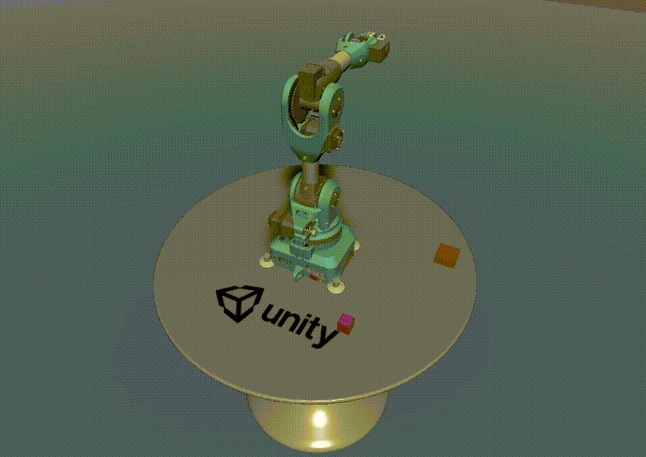

# Pick and Place Tutorial [DRAFT]

Placeholder introduction. Something about using ROS, Unity, MoveIt, and pick & place as a task. 

This document breaks down the current status of Jacob & Jonathan’s Pick & Place demo into smaller tutorials that start from scratch (with provided assets). 

## Table of Contents

- [Pick and Place Tutorial [DRAFT]](#pick-and-place-tutorial-draft)
  - [Table of Contents](#table-of-contents)
  - [Step 1: Create Unity scene with imported URDF](#step-1-create-unity-scene-with-imported-urdf)
  - [Step 2: Unity & ROS Integration](#step-2-unity--ros-integration)
  - [Step 3: Naive Pick & Place](#step-3-naive-pick--place)

Download the provided assets here:

1. [Unity Package](https://drive.google.com/file/d/1XVgXX_z_jlbT3s5NeKMbVpBpMrLlT9pY/view?usp=sharing)
2. [ROS Package](https://drive.google.com/file/d/1IF29DtmP-eX-0iP5gG4aWUs6yNM1iL5p/view?usp=sharing) (DRAFT)

---

## [Step 1: Create Unity scene with imported URDF](1_urdf.md) 

[PLACEHOLDER]

This step includes downloading and installing the Unity Editor, setting up a basic Unity scene, and importing a robot using the URDF importer.

<!-- Assumptions: ?

By the end of this tutorial: User should have Unity Hub and Unity 2020.2+ installed with a basic sensical scene setup, including a static floor and table, as well as the cube and UR3 articulation arm. 

Verification: Pressing Play in the editor does nothing and throws no errors, the scene has proper setup (e.g. gravity, colliders), and lengths of the articulation body can be highlighted with arrow keys via the built-in URDF importer -->

---

## [Step 2: Unity & ROS Integration](2_ros_tcp.md)

[PLACEHOLDER]

This step assumes you have access to a functional ROS workspace. Steps covered include creating a TCP connection between Unity and ROS, generating C# scripts from a ROS .msg file, and publishing a Unity GameObject's pose to a ROS topic. 

<!-- Assumptions: Previous steps have been completed (Unity environment). Access to a ROS workspace. Basic understanding of C#.

By the end of this tutorial: The TCP connection between Unity & ROS is functioning. The C# scripts have been generated from the relevant .msg files. The cube pose is successfully published as a ROS topic. The server_endpoint.py runs as expected.

Verification: Running rostopic echo ur3_topic will successfully find the published pose of the static cube and print it. -->

---

## [Step 3: Naive Pick & Place](3_naive.md)
 

[PLACEHOLDER]

This step includes the preparation and setup necessary to run a naive pick and place task using MoveIt. Steps covered include creating and invoking a motion planning service in ROS, moving a Unity Articulation Body based on a calculated trajectory, and controlling a gripping tool to successfully grab an object.

<!-- Assumptions: Previous steps have been completed. Basic understanding of Python.

By the end of this tutorial: All the necessary dependencies have been installed for moveit, rospy. The C# script for MotionPlanningService is generated. Base ur3_gripper_motion_planning_script script and MotionPlanningService/GripperController correctly run a pick & place.

Verification: The necessary processes can be roslaunch-ed with no unexpected errors. Playing the Unity scene will make a TCP connection, send the cube pose, move the arm to the set initial position, prompt the motion planning, and receive the calculated trajectory. The arm will pick & place the cube. -->